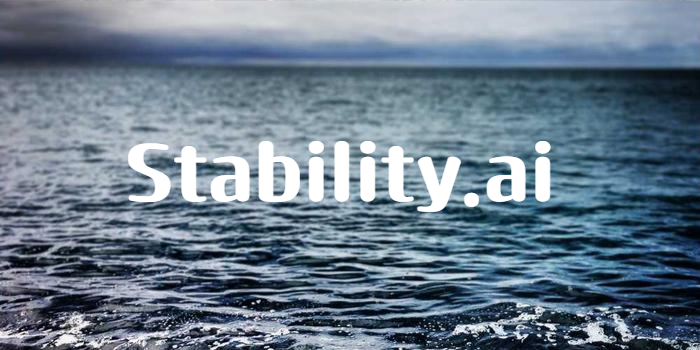

# Stability.ai and Stable Diffusion a Case Study
## 

## ⚠️ **Important Considerations**

> **Warning:** AI technology, while powerful, must be used ethically to avoid global world domination. Thank you!

Stability AI is committed to ethical AI development, ensuring that their models are transparent and fair.
## Overview and Origin

The compnay chosen for this case study was Stability.ai creators of Stable Diffusion, which utilizes diffusion model technology to create networks that can create images, videos, and even music that is comparable to work a human would have done. 

---
Stability.ai was incorporated in 2021. By the most recognizable founding member Emad Mostaque is a British Bengali male and was the founder of this company but withdrawn from the company early 2024. There are 32 other founders but Emad is the one credited with being the most responsible with the success of stability.ai and the technology stable diffusion. 

Stability.ai was created with the goal of democratizing artificial intelligence, particularly in the realm of generative models. The company's flagship project, Stable Diffusion, aims to make powerful image generation technologies accessible to a broader audience. The idea emerged from the desire to provide high-quality, open-source tools for creative and practical applications in AI.

* **How is the company funded? How much funding have they received?** 
  - Stability.ai has received funding from several prominent investors, including venture capital firms. Notable funding rounds include a $100 million Series A round led by Coatue Management and Lightspeed Venture Partners in 2022. The company's total funding is estimated to be around $200 million.

## Business Activities

* **What specific problem is the company or project trying to solve?** 
  - Stability.ai aims to solve the problem of accessibility in generative AI. Before the advent of tools like Stable Diffusion, high-quality image generation was largely restricted to organizations with significant resources. Stability.ai seeks to provide powerful AI tools that anyone can use for creative and practical purposes.

There models have good results and they are always improving. 

| Metric         | Outcome        | Impact          |
| -------------- | -------------- | --------------- |
| Model Accuracy | 98.7%          | High            |
| Time Saved     | 20 hours/week  | Significant     |
| Cost Reduction | 30%            | Substantial     |

* **Who is the company's intended customer? Is there any information about the market size of this set of customers?** 
  - The company's intended customers include artists, designers, content creators, developers, and businesses looking to leverage AI for image generation and enhancement. The market for AI-driven creative tools is growing rapidly, with an increasing number of industries exploring AI for various applications, suggesting a substantial and expanding market size.

* **What solution does this company offer that their competitors do not or cannot offer? (What is the unfair advantage they utilize?)** 
  - Stability.ai’s main solution is Stable Diffusion, an open-source model that generates high-quality images from textual descriptions. Unlike some competitors, Stable Diffusion is designed to be accessible and customizable, allowing users to run it locally or on cloud platforms without needing proprietary hardware. This open-source nature and the flexibility of the model provide a significant advantage over more closed and resource-intensive alternatives.

* **Which technologies are they currently using, and how are they implementing them?** 
  - Stability.ai utilizes diffusion models, a type of generative model that progressively refines noise into images through a series of steps. The Stable Diffusion model uses a combination of transformer-based architectures and advanced neural network techniques to create high-quality, detailed images. The company’s implementation involves releasing these models as open-source software, allowing for broad experimentation and integration.

## Landscape

  Stability.ai operates in the field of artificial intelligence, specifically in generative AI and computer vision. Major trends include the development of more sophisticated generative models, such as Generative Adversarial Networks (GANs) and diffusion models. Innovations have focused on improving image quality, model efficiency, and the ability to generate complex and varied outputs. There has also been a significant movement towards open-source AI tools and democratization of AI technology. Other major companies in the generative AI field include OpenAI (known for GPT and DALL-E), Google DeepMind, and Adobe (with its various AI-powered tools). These companies also work on advanced generative models and AI technologies.

## Results and Future tech

Stability.ai has made a substantial impact by popularizing the use of diffusion models and providing accessible AI tools for image generation. The widespread adoption of Stable Diffusion has influenced various creative industries and has set a precedent for open-source AI projects. Core metrics include the number of active users, model performance (such as image quality and generation speed), and community engagement (such as contributions to the open-source ecosystem). Stability.ai has seen high adoption rates and substantial community engagement, indicating strong performance in these metrics. Stability.ai’s open-source approach and accessibility give it a unique position compared to competitors who may have more proprietary models. While companies like OpenAI have high-profile tools, Stability.ai's emphasis on open-source and community-driven development differentiates it and has garnered significant attention and use within the AI and creative communities.

## Recommendations

  I would recommend developing a suite of complementary tools that enhance the capabilities of Stable Diffusion, such as automated image editing features, integration with popular design software, or enhanced customization options for specific industries (e.g., fashion design, architectural visualization). These additional tools would provide users with more comprehensive solutions, making Stability.ai’s offerings more appealing to a broader range of professionals. This could drive further adoption and increase the company's revenue streams by providing premium or enterprise-level features.

* **Additional Utilization** 
Technologies could include advanced machine learning algorithms, real-time image processing capabilities, and APIs for integration with other software platforms. Tools for automated image editing would likely leverage AI techniques such as deep learning and computer vision.

* **Using this tech to innovate my field** 
  In addition with the power of Large language models and seemless information transfer along with increased hardware capabiliies this tech will most likely be used more and more in job spaces especially areas that reqire information recovered from visual data. 

## An Example of a Diffusion model code structure

---
* **Link to there website.**
  [Stability.ai](https://www.stability.ai)

* **Other Sources.**
[Wikipedia](https://en.wikipedia.org/wiki/Stability_AI)
